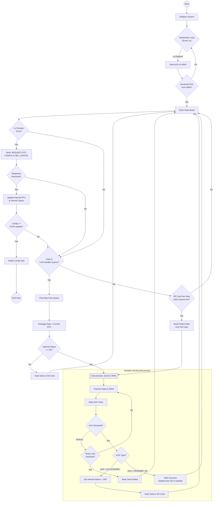
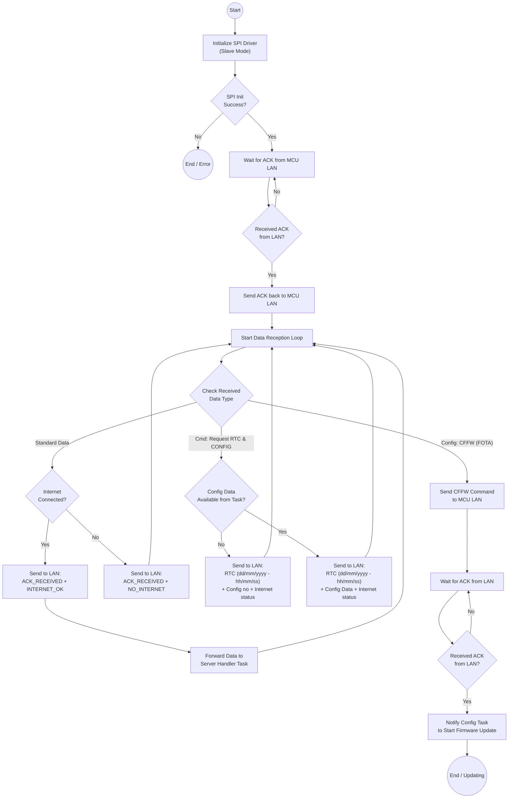

### MCU WAN Comm Handler Task

```mermaid
flowchart TD
    Start((Start)) --> InitSystem[Initialize System]
    
    %% Phase 1: Handshake
    InitSystem --> HandshakeLoop{"Handshake Loop<br/>(Every 1s)"}
    HandshakeLoop -- 1s Elapsed --> SendHandshake[Send ACK to WAN]
    SendHandshake --> WaitHandshakeAck{"Received ACK<br/>from WAN?"}
    WaitHandshakeAck -- No --> HandshakeLoop
    WaitHandshakeAck -- Yes --> MainLoop[Enter Data Mode]

    %% Phase 2: Main Loop
    MainLoop --> CheckPeriodic{"1s Periodic<br/>Timer?"}
    
    %% Periodic Request Branch
    CheckPeriodic -- Yes --> SendReq["Send: REQUEST RTC,<br/>CONFIG & NET_STATUS"]
    SendReq --> WaitReqResp{"Response<br/>Received?"}
    WaitReqResp -- Yes --> UpdateInfo["Update internal RTC<br/>& Internet Status"]
    UpdateInfo --> CheckFota{"Config ==<br/>FOTA Update?"}
    CheckFota -- Yes --> NotifyFota[Notify Config Task]
    NotifyFota --> EndTask((End Task))
    CheckFota -- No --> CheckQueue
    WaitReqResp -- No --> CheckQueue

    %% Data Processing Branch (Priority Logic)
    CheckPeriodic -- No --> CheckQueue{"Data in<br/>LAN Handler Queue?"}
    
    %% Case A: Real-time Data (Priority)
    CheckQueue -- Yes --> PopQueue[Pop Data from Queue]
    PopQueue --> PackageData[Package Data + Current RTC]
    PackageData --> CheckNetStatus{"Internet Status<br/>== OK?"}
    
    CheckNetStatus -- No --> SaveSD[Save Data to SD Card]
    SaveSD --> MainLoop
    
    CheckNetStatus -- Yes --> SendWanProcess[[Sub-process: Send to WAN]]
    
    %% Case B: SD Card Recovery (Lower Priority)
    CheckQueue -- No --> CheckSD{"SD Card has Data<br/>AND Internet OK?"}
    CheckSD -- No --> MainLoop
    CheckSD -- Yes --> ReadSD[Read Oldest Data<br/>from SD Card]
    ReadSD --> SendWanProcess
    
    %% Sub-process: Send with ACK Timer & Retry
    subgraph SendLogic [Reliable Sending Mechanism]
        direction TB
        SendWanProcess --> Transmit[Transmit Data to WAN]
        Transmit --> StartTimer[Start ACK Timer]
        StartTimer --> WaitAck{"ACK Received?"}
        
        WaitAck -- Timeout --> RetryCount{"Retry Limit<br/>Reached?"}
        RetryCount -- No --> Transmit
        RetryCount -- Yes --> MarkFail[Mark Send Failed]
        
        WaitAck -- Yes --> CheckAckType{"ACK Type?"}
        CheckAckType -- "ACK + NO INTERNET" --> UpdateNetFail[Set Internet Status = OFF]
        UpdateNetFail --> SaveToSD_Sub[Save Data to SD Card]
        
        CheckAckType -- "ACK + INTERNET OK" --> MarkSuccess["Mark Success<br/>(Delete from SD if needed)"]
    end
    
    MarkFail --> MainLoop
    SaveToSD_Sub --> MainLoop
    MarkSuccess --> MainLoop
```
### MCU LAN Comm Handler Task

```mermaid
flowchart TD
    Start((Start)) --> InitSPI["Initialize SPI Driver<br/>(Slave Mode)"]
    
    InitSPI --> CheckSPI{"SPI Init<br/>Success?"}
    CheckSPI -- No --> ErrorEnd((End / Error))
    CheckSPI -- Yes --> WaitHandshake["Wait for ACK from MCU LAN"]
    
    WaitHandshake --> GotHandshake{"Received ACK<br/>from LAN?"}
    GotHandshake -- No --> WaitHandshake
    GotHandshake -- Yes --> SendHandshake["Send ACK back to MCU LAN"]
    
    SendHandshake --> ListenLoop["Start Data Reception Loop"]
    
    ListenLoop --> CheckDataType{"Check Received<br/>Data Type"}
    
    %% Branch 1: Standard Telemetry Data
    CheckDataType -- "Standard Data" --> CheckInternet{"Internet<br/>Connected?"}
    
    CheckInternet -- Yes --> SendAckNet["Send to LAN:<br/>ACK_RECEIVED + INTERNET_OK"]
    SendAckNet --> FwdServer["Forward Data to<br/>Server Handler Task"]
    FwdServer --> ListenLoop
    
    CheckInternet -- No --> SendAckNoNet["Send to LAN:<br/>ACK_RECEIVED + NO_INTERNET"]
    SendAckNoNet --> ListenLoop
    
    %% Branch 2: RTC & Config Request
    CheckDataType -- "Cmd: Request RTC & CONFIG" --> CheckConfigQueue{"Config Data<br/>Available from Task?"}
    
    CheckConfigQueue -- No --> SendNoConfig["Send to LAN:<br/>RTC (dd/mm/yyyy - hh/mm/ss)<br/>+ Config no + Internet status"]
    SendNoConfig --> ListenLoop
    
    CheckConfigQueue -- Yes --> SendConfig["Send to LAN:<br/>RTC (dd/mm/yyyy - hh/mm/ss)<br/>+ Config Data + Internet status"]
    SendConfig --> ListenLoop
    
    %% Branch 3: FOTA / CFFW
    CheckDataType -- "Config: CFFW (FOTA)" --> SendCFFW["Send CFFW Command<br/>to MCU LAN"]
    SendCFFW --> WaitFotaAck["Wait for ACK from LAN"]
    
    WaitFotaAck --> GotFotaAck{"Received ACK<br/>from LAN?"}
    GotFotaAck -- No --> WaitFotaAck
    GotFotaAck -- Yes --> NotifyFota["Notify Config Task<br/>to Start Firmware Update"]
    NotifyFota --> FotaEnd((End / Updating))
```