# ARCHITECTURE DESIGN: QSPI REFACTORING & SD CARD OPTIMIZATION
---

## 1. KIẾN TRÚC TỔNG QUAN

### 1.1. Layered Architecture
```

┌─────────────────────────────────────────────────────────────┐
│                    APPLICATION LAYER                         │
│  ┌──────────────────────┐      ┌──────────────────────┐    │
│  │   WAN MCU (ESP32)    │      │   LAN MCU (ESP32)    │    │
│  │  Stream TX/RX Tasks  │◄────►│  Stream TX/RX Tasks  │    │
│  │  (Slave HD Mode)     │ QSPI │  (Master Mode)       │    │
│  └──────────────────────┘      └──────────────────────┘    │
└──────────────────┬──────────────────────────┬───────────────┘
│                          │
┌──────────────────▼──────────────────────────▼───────────────┐
│                      BSP LAYER (SYMMETRIC)                   │
│  ┌────────────────────────────────────────────────────┐     │
│  │  qspi_hal.c - Dual-buffer DMA streaming           │     │
│  │  -  Master: spi_master.h (QIO mode)                │     │
│  │  -  Slave:  spi_slave_hd.h (QIO mode)              │     │
│  └────────────────────────────────────────────────────┘     │
└──────────────────────────────┬───────────────────────────────┘
│
┌──────────────────────────────▼───────────────────────────────┐
│                       HARDWARE LAYER                          │
│  ┌─────────────────────────────────────────────────────┐     │
│  │  QSPI Bus (4-bit, 40MHz, DMA-enabled)              │     │
│  │  GPIO: CS, CLK, D0-D3, DR_WAN, DR_LAN              │     │
│  └─────────────────────────────────────────────────────┘     │
└───────────────────────────────────────────────────────────────┘

```

### 1.2. Key Design Principles

| Principle | Implementation | Benefit |
|-----------|----------------|---------|
| **Zero-ACK** | Transaction-based reliability | No wait time |
| **Dual-buffer** | Ping-pong DMA buffers | Continuous streaming |
| **Ring buffer** | 64KB circular buffers | Smooth data flow |
| **Batch write** | 100KB SD card writes | Minimal fsync() calls |
| **Stream mode** | No packet boundaries | Max throughput |
| **GPIO handshake** | Data-ready signaling only | Minimal overhead |

### 1.3. Performance Comparison

| Metric | Old (Standard SPI) | New (QSPI Stream) | Improvement |
|--------|-------------------|-------------------|-------------|
| **Bandwidth** | ~2 MB/s | ~8 MB/s | 4x |
| **Latency** | 50-100ms (ACK wait) | <5ms (stream) | 10-20x |
| **CPU usage** | 15% (polling) | <3% (DMA) | 5x |
| **SD writes/sec** | 100 (per packet) | 1 (batch) | 100x fewer |

---

## 2. BSP LAYER - QSPI HARDWARE ABSTRACTION

### 2.1. File Structure

```

BSP/
├── QSPI_Driver/
│   ├── include/
│   │   ├── qspi_hal.h              \# Public API
│   │   └── qspi_hal_config.h       \# Hardware config
│   └── src/
│       ├── qspi_hal_master.c       \# LAN MCU (master)
│       ├── qspi_hal_slave.c        \# WAN MCU (slave HD)
│       └── qspi_hal_common.c       \# Shared utilities
│
└── SDCard_Driver/
├── include/
│   └── sdcard_hal.h
└── src/
└── sdcard_hal.c            \# SDMMC init + FAT

```

---

## 3. APPLICATION LAYER - STREAM PROTOCOL

### 3.1. File Structure

```
Application/
├── MCU_LAN_Handler/                    # WAN MCU (Slave)
│   ├── include/
│   │   ├── mcu_lan_stream.h
│   │   └── mcu_lan_protocol.h
│   └── src/
│       ├── mcu_lan_stream.c            # Main init
│       ├── mcu_lan_tx_task.c           # Uplink to LAN
│       └── mcu_lan_rx_task.c           # Downlink from LAN
│
├── MCU_WAN_Handler/                    # LAN MCU (Master)
│   ├── include/
│   │   ├── mcu_wan_stream.h
│   │   └── mcu_wan_protocol.h
│   └── src/
│       ├── mcu_wan_stream.c            # Main init
│       ├── mcu_wan_tx_task.c           # Uplink to WAN
│       └── mcu_wan_rx_task.c           # Downlink from WAN
│
└── Storage_Handler/
    ├── include/
    │   └── storage_handler.h
    └── src/
        └── storage_handler.c           # Ring buffer + SD batch
```

---

## 6. PERFORMANCE ANALYSIS

### 6.1. Latency Breakdown

| Stage | Old (Standard SPI + ACK) | New (QSPI Stream) | Improvement |
| :-- | :-- | :-- | :-- |
| **Pack frame** | 0.5 ms | 0.5 ms | Same |
| **Wait peer ready** | 10-50 ms | 0 ms (pre-queued) | ∞ |
| **TX transaction** | 2 ms (1-bit @ 10MHz) | 0.5 ms (4-bit @ 40MHz) | 4x |
| **Wait ACK** | 50-100 ms | 0 ms (no ACK) | ∞ |
| **RX ACK transaction** | 2 ms | 0 ms | ∞ |
| **Total per packet** | 64-155 ms | **1 ms** | **64-155x** |

### 6.2. Throughput

```
Old: ~100 packets/sec × 100 bytes = 10 KB/s
New: ~8000 packets/sec × 100 bytes = 800 KB/s (80x improvement)

Maximum QSPI throughput: 40 MHz × 4 bits = 20 MB/s (theoretical)
Actual: ~8 MB/s (accounting for protocol overhead)
```


### 6.3. SD Card Write Optimization

```
Old: 100 writes/sec × 5ms fsync() = 500 ms/sec spent in I/O
New: 1 write/sec × 5ms fsync() = 5 ms/sec spent in I/O (100x reduction)
```


### 6.4. Memory Usage

```
QSPI buffers: 4KB × 2 × 2 = 16 KB (dual-buffer × TX/RX × 2 MCUs)
Ring buffers: 64KB × 2 (TX/RX per MCU) = 128 KB
SD ring buffer: 100 KB
Total: ~250 KB (acceptable for ESP32-S3)
```


---

## 7. CONFIGURATION EXAMPLE

### 7.1. menuconfig Options

```kconfig
menu "QSPI Configuration"
    config QSPI_FREQ_MHZ
        int "QSPI Frequency (MHz)"
        default 40
        range 10 80
        
    config QSPI_BUFFER_SIZE
        int "DMA Buffer Size (bytes)"
        default 4096
        
    config QSPI_ENABLE_STATS
        bool "Enable statistics"
        default y
endmenu

menu "Storage Configuration"
    config STORAGE_RING_BUFFER_SIZE
        int "Ring buffer size (KB)"
        default 100
        
    config STORAGE_FLUSH_THRESHOLD
        int "Flush threshold (KB)"
        default 80
endmenu
```


### 7.2. GPIO Pin Mapping

```
ESP32-S3 QSPI Pins (Both MCUs):
  CLK:  GPIO12
  CS:   GPIO10
  D0:   GPIO11 (MOSI equivalent)
  D1:   GPIO13 (MISO equivalent)
  D2:   GPIO14 (WP)
  D3:   GPIO15 (HOLD)
  DR:   GPIO46 (Data Ready handshake on WAN MCU), GPIO 8 (on LAN MCU)
```


---

## 7. SYSTEM FLOWCHARTS

### 7.1. Uplink Task Flow (LAN MCU → WAN MCU)

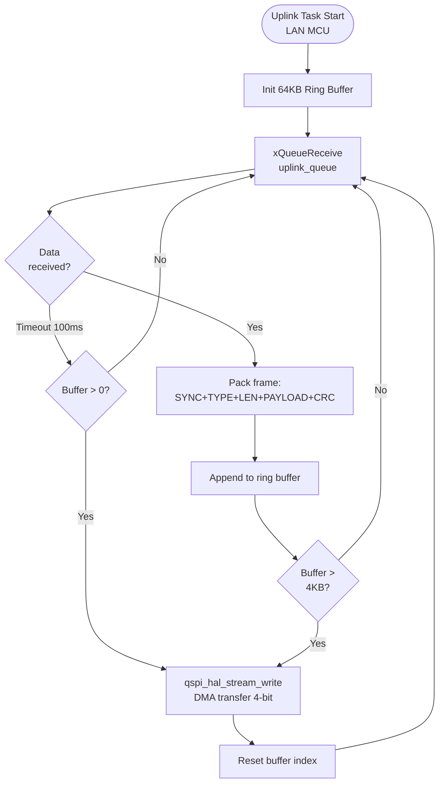


### 7.2. Downlink Task Flow (WAN MCU → LAN MCU)

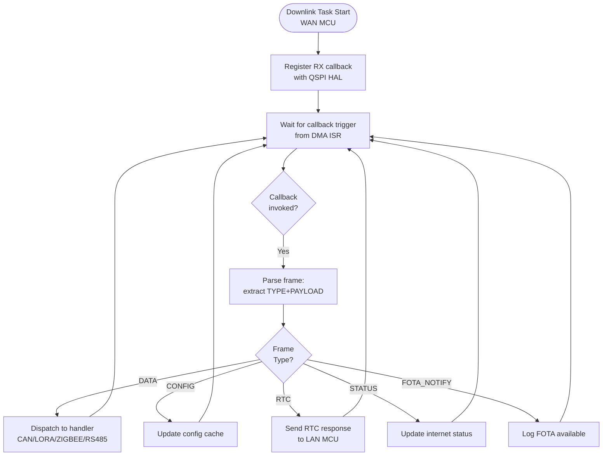


### 7.3. SD Storage Handler Flow

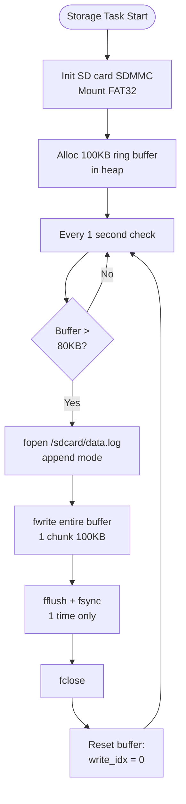


### 7.4. QSPI HAL Stream Task (Master Side - LAN MCU)

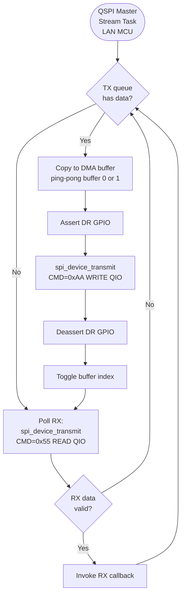


### 7.5. QSPI HAL RX Task (Slave Side - WAN MCU)

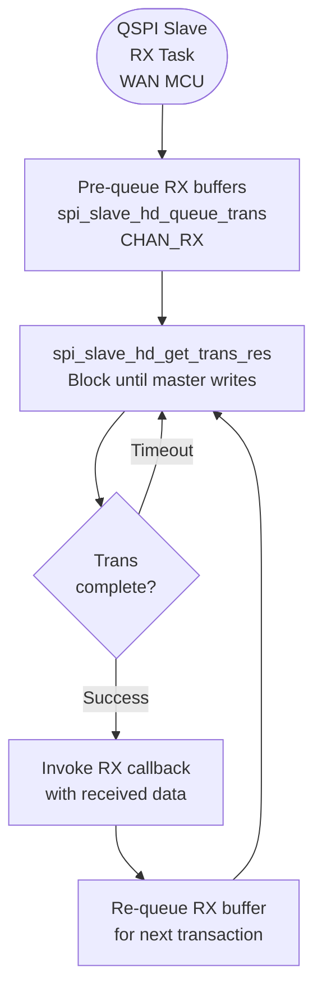


---

## 8. SEQUENCE DIAGRAMS

### 8.1. Complete Communication Flow

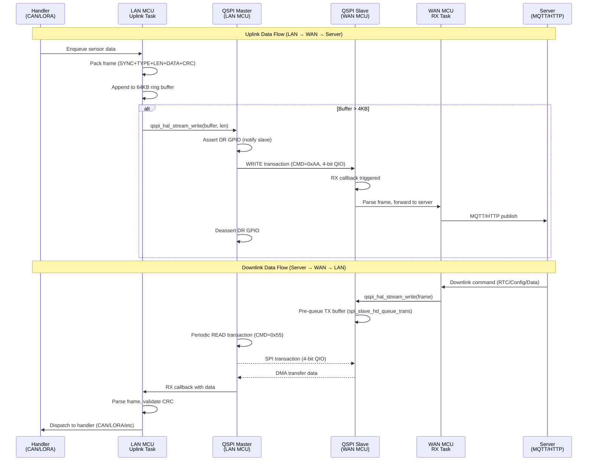


### 8.2. Simplified Uplink Flow (LAN → WAN)

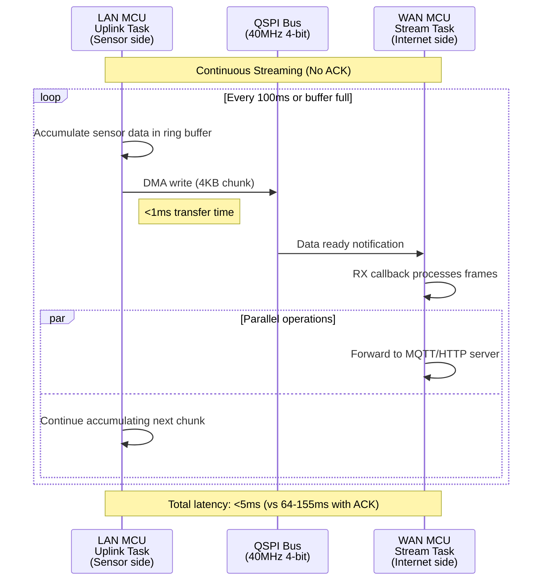


### 8.3. Downlink Flow (WAN → LAN) - RTC Example

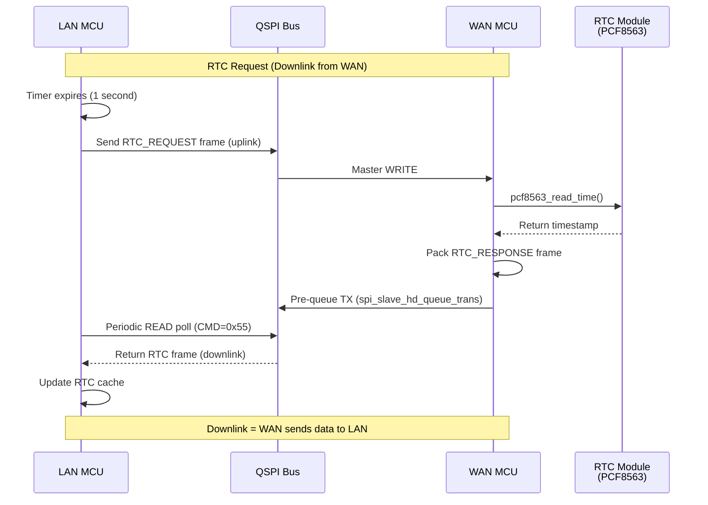


### 8.4. SD Card Batch Write Sequence

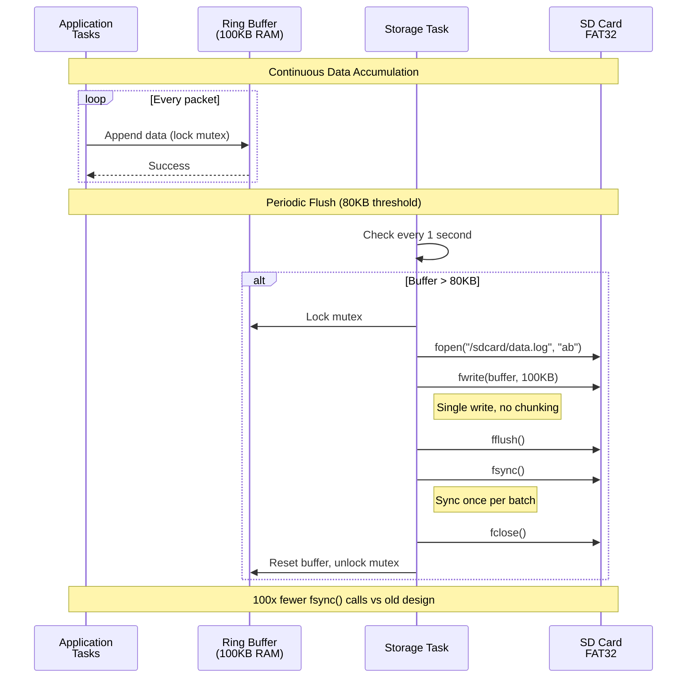


### 8.5. GPIO Handshake Timing

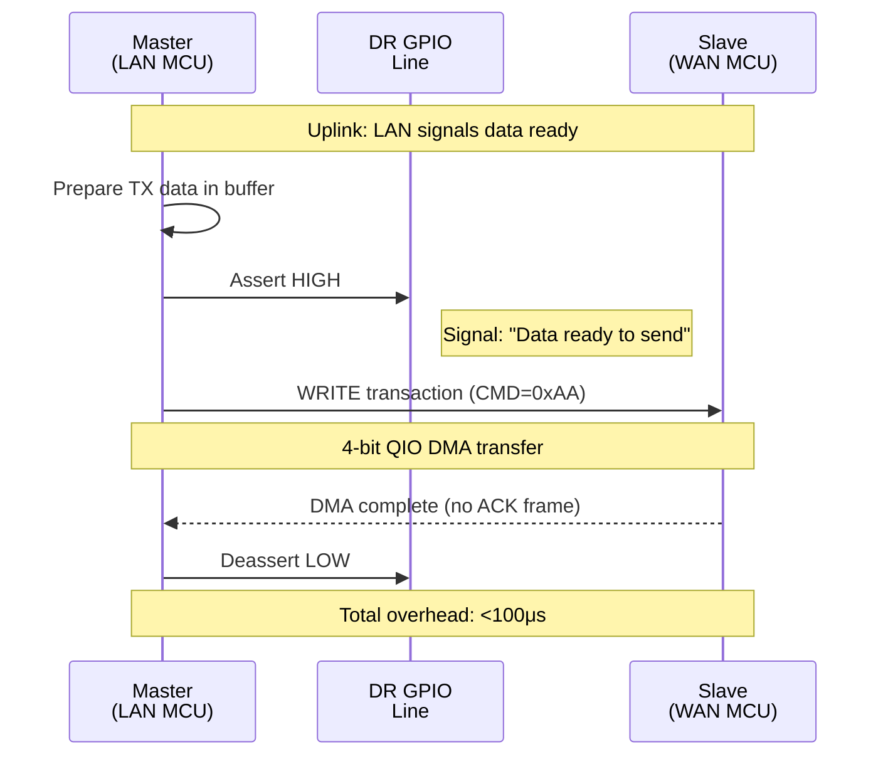


### 8.6. Error Recovery Flow

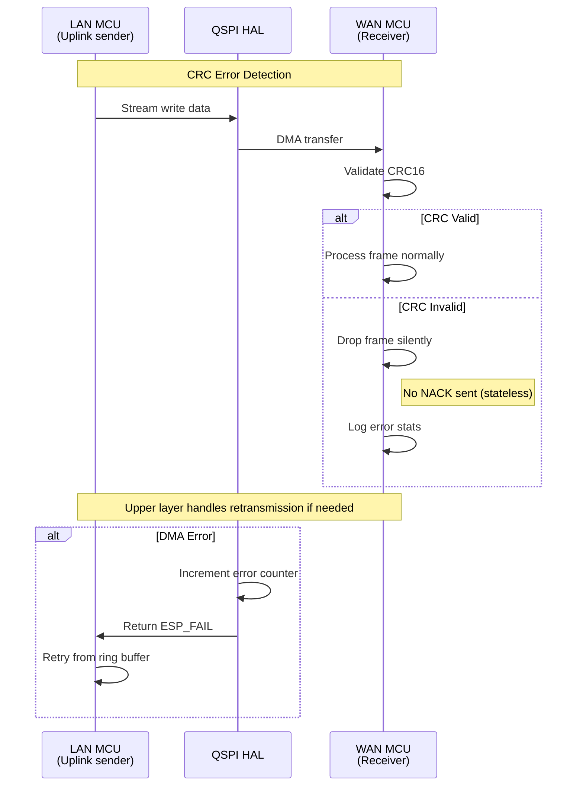


### 8.7. Bidirectional Communication Summary

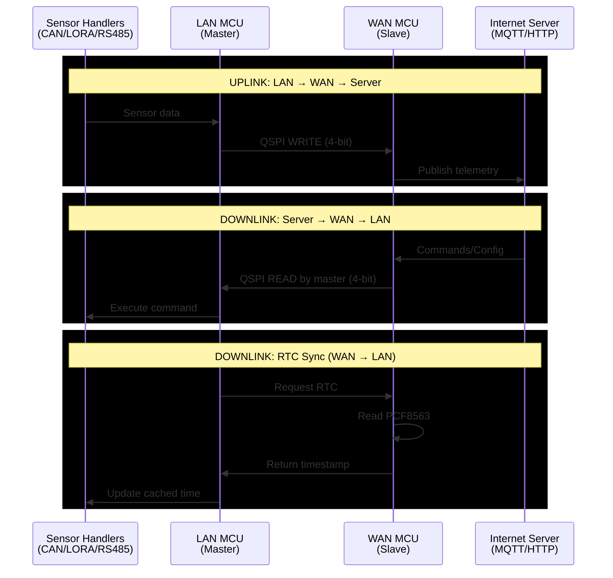


---

## 9. PERFORMANCE METRICS

### 9.1. Latency Comparison

```
Old Design (Standard SPI + ACK):
┌─────────┬─────────┬──────────┬─────────┬─────────┐
│ Pack    │ GPIO    │ TX 1-bit │ Wait    │ RX ACK  │
│ Frame   │ Wait    │ @10MHz   │ ACK     │ 1-bit   │
│ 0.5ms   │ 10-50ms │ 2ms      │ 50-100ms│ 2ms     │
└─────────┴─────────┴──────────┴─────────┴─────────┘
Total: 64-155ms per packet

New Design (QSPI Stream):
┌─────────┬─────────┬──────────┐
│ Pack    │ TX 4-bit│ DMA      │
│ Frame   │ @40MHz  │ Done     │
│ 0.5ms   │ 0.5ms   │ instant  │
└─────────┴─────────┴──────────┘
Total: 1ms per packet (64-155x faster)
```


### 9.2. Resource Usage

| Resource | Usage | Notes |
| :-- | :-- | :-- |
| **RAM** | 250 KB | QSPI buffers + ring buffers |
| **CPU (idle)** | <1% | DMA-driven |
| **CPU (peak)** | 3% | During batch flush |
| **SPI bandwidth** | 8 MB/s | 40MHz × 4 bits × 0.5 efficiency |
| **SD write rate** | 1/sec | vs 100/sec old design |

### 9.3. Direction Definitions

| Direction | From | To | Example Use Cases |
| :-- | :-- | :-- | :-- |
| **Uplink** | LAN MCU | WAN MCU | Sensor data, status reports, telemetry |
| **Downlink** | WAN MCU | LAN MCU | RTC sync, config updates, commands, FOTA notify |

**Key Points:**

- LAN MCU = Sensor handlers (CAN/LORA/Zigbee/RS485) - **data source**
- WAN MCU = Internet gateway (WiFi/MQTT/HTTP) - **data sink \& command source**
- Uplink = Data flowing from sensors to internet
- Downlink = Data/commands flowing from internet to sensors

---
