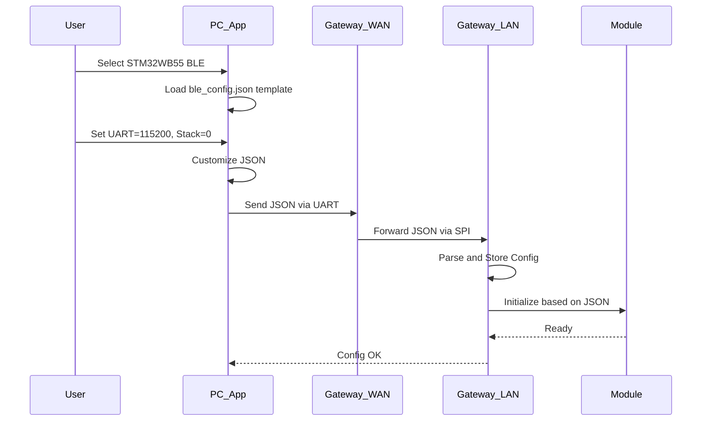
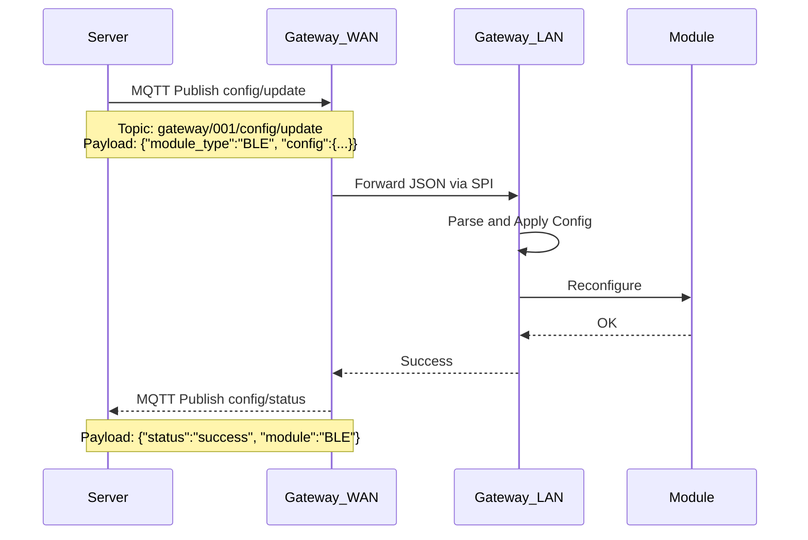
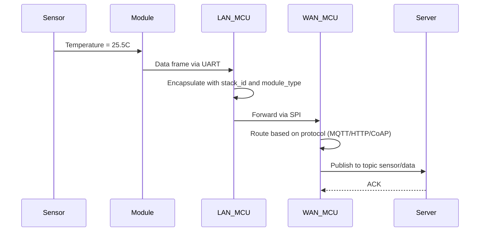
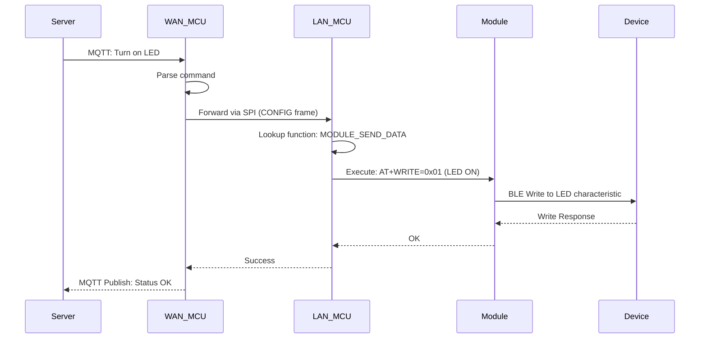
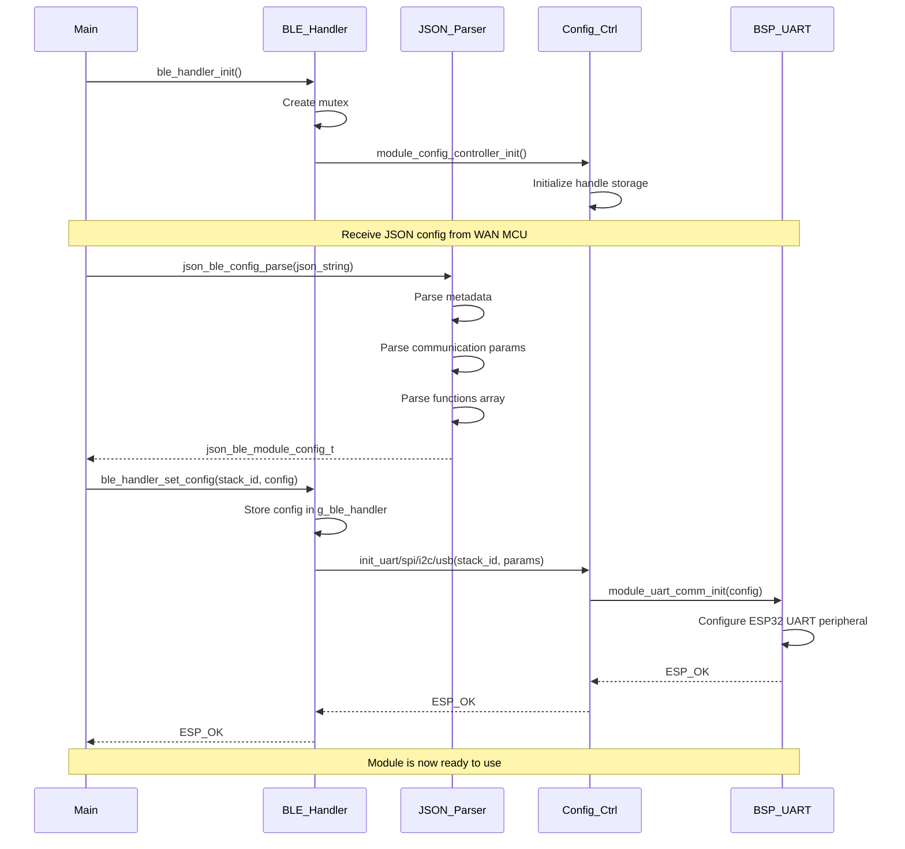
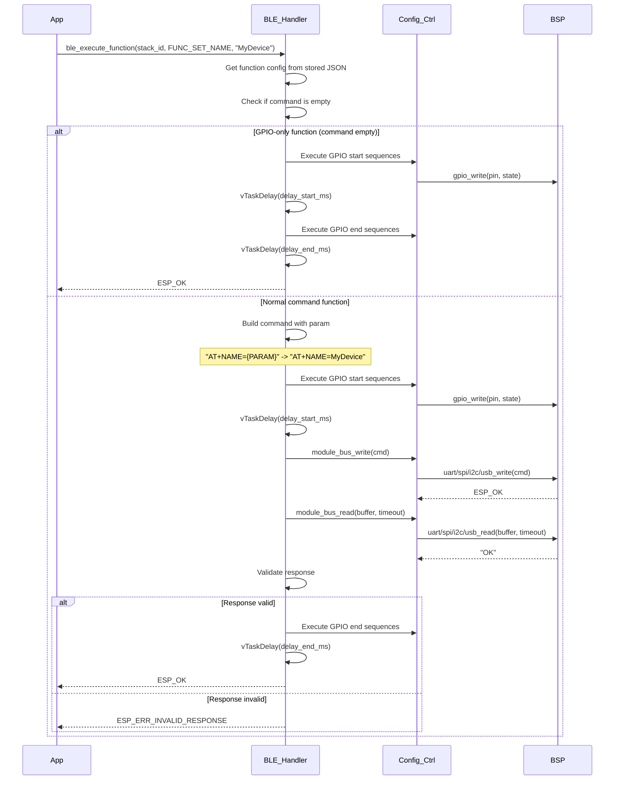

## TECHNICAL REPORT: MODULE BASE SETTING SYSTEM

---

## 1. OVERVIEW AND CONCEPT

### 1.1. Problem Statement

In our current Gateway system, we need to support multiple types of wireless modules (BLE, Zigbee, LoRa, Thread) from various manufacturers. Each module has:
- Different command syntax in AT format, ASCII format, binary format (e.g., AT+NAME=xxx, AT+SETNAME=xxx, AT+DEVNAME=xxx) 
- Different communication protocols (UART, SPI, I2C, USB)
- Different GPIO control mechanisms (Reset, Wake, Boot mode pins)
- Different timeout values and response formats

If we hardcode for each module, the code will be:
- Very long and complex
- Difficult to maintain and extend
- Requires firmware recompilation for every new module
- Inflexible when customers want to change modules

### 1.2. Module Base Setting Solution

Instead of standardizing COMMANDS (not feasible), we standardize by FUNCTION.

**Example:**
```
Function: MODULE_SET_NAME
- STM32WB55 BLE: AT+NAME=DeviceName\r\n
- HC-05 BLE: AT+NAME:DeviceName\r\n  
- ESP32 BLE: AT+BLENAME=DeviceName\r\n
- nRF52 BLE: AT+GAPDEVNAME=DeviceName\r\n
```

All perform the SAME FUNCTION: Set device name.

### 1.3. Why Choose This Approach?

**Reason 1: 70-80% of Functions are IDENTICAL**
- Almost all BLE modules have: Reset, Set Name, Connect, Disconnect, Scan, Send Data
- Differences are only in: Command syntax, GPIO pins, timeout values

**Reason 2: FLEXIBILITY**
- No need to recompile firmware when adding new modules
- Simply create a new JSON file for that module
- PC App or Server sends JSON config to Gateway

**Reason 3: EASY MAINTENANCE**
- Firmware code is GENERIC, not module-specific
- JSON files are EXTERNAL CONFIG, easy to edit
- Testing and debugging are much easier

**Reason 4: GOOD SCALABILITY**
- Add new module: Just write a JSON file
- Add new function: Just update function_id enum and JSON file
- Support multiple stacks in parallel (Stack 0, Stack 1)

---

## 2. WHY COMPATIBLE WITH MULTIPLE MODULES?

### 2.1. Abstraction Principle

The Module Base Setting system is separated into 3 layers:

```
+---------------------+
|   JSON Config File  |  <-- MODULE SPECIFIC (External)
+---------------------+
          |
          v
+---------------------+
|  Function Handler   |  <-- GENERIC (Firmware)
|   (ble_handler.c)   |
+---------------------+
          |
          v
+---------------------+
|  BSP/Driver Layer   |  <-- HARDWARE SPECIFIC (Firmware)
|  (UART/SPI/I2C/USB) |
+---------------------+
```

### 2.2. Which Functions are STANDARD?

We analyzed 8 popular BLE modules and found:

| Function | STM32WB55 | HC-05 | ESP32 | nRF52 | CC2640 | DA14580 | BL600 | BGM113 |
|----------|-----------|-------|-------|-------|--------|---------|-------|--------|
| HW Reset | GPIO | GPIO | GPIO | GPIO | GPIO | GPIO | GPIO | GPIO |
| SW Reset | AT+RESET | AT+RESET | AT+RST | AT+RESET | AT+RESET | AT+R | AT+ATZ | AT+RESET |
| Set Name | AT+NAME= | AT+NAME: | AT+BLENAME= | AT+GAPDEVNAME= | AT+NAME= | AT+REN | AT+CFG 532 | gatt_device_name |
| Connect | AT+CONNECT= | AT+LINK= | AT+BLECONN= | AT+GAPCONNECT= | AT+CON= | AT+CON | AT+BTCconnect | ble_gap_connect |
| Scan | AT+SCAN | AT+INQ | AT+BLESCAN | AT+GAPSCAN | AT+DISC | AT+SCAN | AT+INQUIRY | ble_gap_discover |

**Conclusion:** 
- **FUNCTIONS**: 100% IDENTICAL
- **COMMANDS**: 100% DIFFERENT

Therefore, if we standardize by FUNCTION, we can support ALL modules just by changing the JSON file.

### 2.3. Complete Abstraction Mechanism

#### 2.3.1. Command Abstraction

JSON file contains:
- Function name: MODULE_SET_NAME
- Command template: AT+NAME={PARAM}\r\n

Firmware executes:
- Calls function with parameter "MyDevice"
- Firmware automatically replaces {PARAM} with "MyDevice"
- Sends: "AT+NAME=MyDevice\r\n"

#### 2.3.2. Protocol Abstraction

JSON file contains:
- Port type: UART
- Parameters: baudrate 115200, parity none, stopbit 1

Firmware calls generic bus functions:
- module_bus_write() and module_bus_read()

System automatically routes to:
- module_uart_comm_write() if port_type = "uart"
- module_spi_comm_write() if port_type = "spi"
- module_i2c_comm_write() if port_type = "i2c"
- module_usb_comm_write() if port_type = "usb"

#### 2.3.3. GPIO Abstraction

JSON file contains:
- Function: MODULE_HW_RESET
- GPIO start: RST pin = LOW
- Delay start: 100ms
- GPIO end: RST pin = HIGH
- Delay end: 1000ms

Firmware execution sequence:
1. Execute GPIO start sequences (pull RST LOW)
2. Wait delay_start_ms (100ms)
3. Send command (if any)
4. Wait for response
5. Execute GPIO end sequences (pull RST HIGH)
6. Wait delay_end_ms (1000ms)

### 2.4. Compatibility Conclusion

The Module Base Setting system can support ANY module that has:
- AT-based or Binary protocol commands
- UART/SPI/I2C/USB communication
- GPIO control for Reset/Boot/Wake
- Timeout and response validation

Only need to create 1 JSON file describing that module.

---

## 3. ROLE OF PC APP / SERVER

### 3.1. PC App: Gateway Configuration Tool

PC App (Gateway_Config_Tool_v4) is responsible for:

#### 3.1.1. Module Selection Interface

Provides user interface for:
- Selecting module type (STM32WB55 BLE, nRF52840, HC-05, etc.)
- Configuring communication parameters (UART baudrate, SPI speed, etc.)
- Loading custom JSON configurations
- Generating and sending config to Gateway

#### 3.1.2. JSON Config Generation

When user selects a module, the App will:
1. Load template JSON from database (embedded or cloud)
2. Customize based on user input (baudrate, GPIO mapping)
3. Validate JSON format
4. Send JSON string to Gateway via UART

**Data Flow:**


#### 3.1.3. Module Testing Interface

After configuration, PC App allows direct testing:
- Hardware Reset, Software Reset, Get Info buttons
- Set Name input and Apply
- Scan Devices function
- Connect to specific device
- Response log display showing AT commands and responses

### 3.2. Server: Remote Configuration Management

Server (MQTT/HTTP/CoAP) is responsible for:

#### 3.2.1. Centralized Config Storage

Cloud server maintains configuration repository:
- devices/gateway_001/ble_config.json
- devices/gateway_001/zigbee_config.json
- devices/gateway_002/ble_config.json
- etc.

#### 3.2.2. Remote Update Flow

**MQTT Topic Structure:**
- gateway/{device_id}/config/update (Server publishes JSON config)
- gateway/{device_id}/config/status (Gateway reports status)
- gateway/{device_id}/config/request (Gateway requests config)

**Communication Flow:**


#### 3.2.3. Bulk Update Management

Server can push updates simultaneously to multiple gateways:
- Load new configuration (e.g., stm32wb55_v2.json)
- Iterate through all registered gateways
- Publish update to each gateway's MQTT topic
- Wait for confirmation with timeout
- Track success/failure for each gateway

### 3.3. Advantages of This Approach

1. **Zero Downtime Update**: Configuration updates without Gateway restart
2. **Version Control**: Server stores history of all config versions
3. **Rollback**: Can revert to previous config if errors occur
4. **A/B Testing**: Test new config on subset of gateways before wide deployment
5. **Monitoring**: Server tracks configuration status of all gateways

---

## 4. ROLE OF BASEBOARD GATEWAY

### 4.1. Gateway Architecture

Gateway consists of 2 MCUs:

```
+---------------------------+        +---------------------------+
|      WAN MCU (ESP32)      |        |      LAN MCU (ESP32)      |
|---------------------------|        |---------------------------|
| - MQTT/HTTP/CoAP Client   |        | - Module Management       |
| - WiFi/4G Connection      | <-SPI->| - JSON Config Parser      |
| - Data Routing            |        | - UART/SPI/I2C/USB Driver |
| - OTA Update              |        | - Multi-Stack Support     |
+---------------------------+        +---------------------------+
         ^                                      ^
         |                                      |
         v                                      v
+------------------+              +---------------------------+
|   PC App /       |              |    Wireless Modules       |
|   Server         |              | - BLE (Stack 0)           |
+------------------+              | - Zigbee (Stack 1)        |
                                  | - LoRa, Thread, etc.      |
                                  +---------------------------+
```

### 4.2. WAN MCU: Internet Communication Handler

**Main Responsibilities:**
- Receive JSON config from PC App (via UART) or Server (via MQTT/HTTP)
- Forward JSON to LAN MCU via SPI
- Route sensor data from LAN MCU to Server
- Route control commands from Server to LAN MCU

**Does NOT:**
- Parse JSON (to reduce processing load)
- Know details about BLE/Zigbee/LoRa modules
- Acts only as a TRANSPARENT BRIDGE

### 4.3. LAN MCU: Module Configuration Controller

**Main Responsibilities:**

#### 4.3.1. JSON Config Reception and Parsing

When receiving CONFIG_UPDATE_BLE_JSON command:
- Parse JSON string
- Store configuration in BLE handler
- Initialize communication port (UART/SPI/I2C/USB)
- Module is now ready to use

#### 4.3.2. Function Execution Engine

When receiving command from Server or PC App:

**Execution Steps:**
1. Find function config from stored JSON
2. Build final command (replace {PARAM} placeholder)
3. Execute GPIO start sequences (if any) and wait delay_start
4. Send command via configured bus
5. Wait and validate response with timeout
6. Execute GPIO end sequences and wait delay_end
7. Return result

#### 4.3.3. Multi-Stack Management

LAN MCU supports multiple modules running simultaneously:
- Stack 0: BLE Module (UART, 115200 baud)
- Stack 1: Zigbee Module (SPI, 2MHz)
- Both stacks run independently with separate tasks and queues

### 4.4. Data Flow: Sensor Data Upload



### 4.5. Data Flow: Control Command from Server



### 4.6. Critical Role of Gateway

Gateway is NOT just a simple bridge, it is:

1. **Configuration Manager**: Receives, parses, and applies module configuration
2. **Protocol Converter**: Converts between Internet protocols (MQTT/HTTP) and Module protocols (AT commands)
3. **Multi-Stack Coordinator**: Manages multiple modules simultaneously without conflicts
4. **Data Router**: Routes data between sensors and server
5. **Transparent Bridge**: PC App can connect directly to module through Gateway for testing

---

## 5. ROLE OF JSON FILE

### 5.1. Why JSON is Needed?

#### 5.1.1. Human-Readable and Machine-Parsable

Compared to binary config or hardcoding:
- **BAD (Hardcode)**: Difficult to read, difficult to modify, requires firmware rebuild
- **GOOD (JSON)**: Easy to read, easy to modify, no rebuild needed

JSON provides structured configuration that both humans and machines can understand.

#### 5.1.2. External Configuration

JSON is a separate file, not embedded in firmware:
- **Developer**: Edit JSON to test new modules
- **QA Team**: Create JSON test cases for automation
- **Customer**: Receive JSON from module vendor and import into system
- **Server**: Store and distribute JSON configs

#### 5.1.3. Version Control Friendly

JSON file is easy to version control with Git:
- Clear diff showing what changed (command syntax, timeout values, etc.)
- Easy rollback to previous versions
- Branch and merge support for testing variants

#### 5.1.4. Validation and Schema

JSON can be validated before applying:
- Define schema with required fields and data types
- Validate module_type is one of allowed values (BLE, Zigbee, LoRa, Thread)
- Ensure functions array contains valid entries
- Check timeout values are non-negative numbers
- Raise errors if validation fails

### 5.2. Complete JSON Structure

JSON file contains:
- Module identification (module_id, module_type, module_name)
- Communication configuration (port_type, parameters)
- Function definitions array (20 functions for BLE)

Each function includes:
- Function name
- Command template
- GPIO control sequences
- Timing parameters
- Expected response

### 5.3. JSON vs Alternatives

| Method | Advantages | Disadvantages |
|--------|-----------|---------------|
| **Hardcode** | Fast execution | Hard to modify, requires rebuild |
| **Binary Config** | Compact size | Hard to read, hard to debug |
| **XML** | Structured | Verbose, heavy parsing |
| **INI File** | Simple | No nested structure support |
| **JSON** | Human-readable, structured, lightweight parser | Slightly verbose |

**Conclusion:** JSON is the best choice for this system.

---

## 6. ROLE OF EACH JSON COMPONENT

### 6.1. Module Metadata

**Components:**
- module_id: "002" (Unique identifier for each module in database)
- module_type: "BLE" (Module category - BLE, Zigbee, LoRa, Thread)
- module_name: "STM32WB_BLE_Gateway" (Display name for user interface)

**Purpose:**
- module_id: Unique identification for managing multiple modules
- module_type: Routes to correct handler (BLE handler, Zigbee handler, etc.)
- module_name: User-friendly name displayed in UI

**Usage in Firmware:**
Router checks module_type to determine which handler to use (ble_handler_set_config, zigbee_handler_set_config, etc.)

### 6.2. Communication Configuration

**Structure:**
- port_type: "uart", "spi", "i2c", or "usb"
- parameters: Specific to each port type

#### 6.2.1. Port Type Selection

Based on port_type, firmware initializes the correct BSP driver:
- "uart" -> module_config_controller_init_uart()
- "spi" -> module_config_controller_init_spi()
- "i2c" -> module_config_controller_init_i2c()
- "usb" -> module_config_controller_init_usb()

#### 6.2.2. Protocol Parameters

**UART Parameters:**
- baudrate: 9600, 115200, 921600, etc.
- parity: none, even, odd
- stopbit: 1, 2
- data_bits: 8 (default)

**SPI Parameters:**
- clock_speed: 1000000 (1MHz), 2000000 (2MHz)
- mode: 0, 1, 2, 3 (CPOL, CPHA)
- bit_order: MSB_FIRST, LSB_FIRST

**I2C Parameters:**
- address: 0x50, 0xA0, etc. (7-bit or 10-bit)
- clock_speed: 100000 (Standard), 400000 (Fast), 1000000 (Fast+)

**USB Parameters:**
- vid: Vendor ID
- pid: Product ID
- interface: Interface number

**Why This Section is Important:**
- Different modules use different protocols
- Same protocol but different parameters
- Firmware needs exact configuration to initialize driver properly

### 6.3. Function Name (Standardized Functions)

**Purpose:** Maps JSON entry to hardcoded function ID in firmware.

**Hardcoded Function IDs:**
Firmware defines 20 function IDs for BLE:
- BLE_FUNC_HW_RESET = 0
- BLE_FUNC_SW_RESET = 1
- BLE_FUNC_FACTORY_RESET = 2
- BLE_FUNC_GET_INFO = 3
- BLE_FUNC_SET_NAME = 4
- ... up to BLE_FUNC_ENTER_BOOTLOADER = 19

**Lookup Process:**
Parser maintains array of function names and performs string comparison to find matching ID.

**Why Hardcode Function Names?**
1. **Contract**: Ensures firmware and JSON config "speak the same language"
2. **Type Safety**: Compile-time checking, prevents typos
3. **Performance**: Fast lookup by integer instead of string comparison every time
4. **Documentation**: Function enum serves as natural documentation for developers

**Module-Specific Functions:**
Different module types can define their own functions:
- Zigbee: FORM_NETWORK, JOIN_NETWORK, PERMIT_JOIN, BIND_DEVICE, etc.
- LoRa: JOIN_OTAA, JOIN_ABP, SEND_UPLINK, SET_DATARATE, etc.

### 6.4. Command (Module-Specific Command Syntax)

**Purpose:**
- Contains actual command sent to module
- Supports placeholder {PARAM} for dynamic parameter passing

**Parameter Substitution:**
Firmware replaces {PARAM} placeholder with actual parameter value:
- Input: command = "AT+NAME={PARAM}\r\n", param = "MyDevice"
- Output: "AT+NAME=MyDevice\r\n"

**Special Case - Empty Command:**
For GPIO-only functions:
- command field is empty
- Firmware only executes GPIO sequences
- No command sent via UART/SPI

Example: MODULE_HW_RESET uses only GPIO control

**Why This Field is Needed?**
- **Flexibility**: Each module has its own command syntax
- **Dynamic Parameters**: No need to hardcode parameters in firmware
- **Testability**: Can test commands directly from PC App

### 6.5. GPIO Control

#### 6.5.1. GPIO Start Control (Before Sending Command)

**Structure:**
- gpio_start_control: Array of GPIO actions
- Each action specifies pin name and state (HIGH/LOW)
- delay_start: Milliseconds to wait after GPIO sequences

**Purpose:**
- Control GPIO pins BEFORE sending command
- Example: Pull RST pin LOW to reset module

**Execution Sequence:**
1. Execute all GPIO start sequences (set pins to specified states)
2. Wait delay_start_ms
3. Proceed with command sending

**Use Cases:**
- **Hardware Reset**: Pull RST pin LOW -> wait 100ms -> Pull HIGH
- **Boot Mode**: Pull BOOT pin HIGH -> Reset -> Module enters bootloader
- **Wake from Sleep**: Toggle WAKE pin
- **Enable Module**: Pull EN pin HIGH

#### 6.5.2. GPIO End Control (After Receiving Response)

**Structure:**
- gpio_end_control: Array of GPIO actions after command completes
- delay_end: Milliseconds to wait after GPIO end sequences

**Purpose:**
- Control GPIO pins AFTER command completes
- Example: Pull RST pin HIGH so module can run again

**Execution Sequence:**
1. After command sent and response validated
2. Execute all GPIO end sequences
3. Wait delay_end_ms
4. Function returns

**Why GPIO Control is Important?**
1. **Hardware Reset**: Some modules can only be reset via GPIO (no AT command)
2. **Boot Mode Selection**: Need to pull GPIO for module to enter bootloader mode
3. **Power Management**: Turn off module via GPIO to save power
4. **Multi-Module Control**: Each module has different pins, JSON maps correct pins

**GPIO Mapping:**
Hardware design defines physical pins:
- Stack 0 (BLE): RST=GPIO0, BOOT=GPIO1, WAKE=GPIO2
- Stack 1 (Zigbee): RST=GPIO3, BOOT=GPIO4, WAKE=GPIO5

JSON uses symbolic names ("RST", "BOOT", "WAKE")
Firmware resolves symbolic names to physical GPIO numbers based on stack_id

### 6.6. Expected Response (Validation)

**Purpose:**
- Validate that module's response is correct
- Set timeout for waiting

**Response Validation Process:**
1. Wait for response with specified timeout
2. Check if response contains expected string
3. If match found: response valid, function succeeds
4. If no match: response invalid, function fails

**Why Validation is Needed?**
1. **Reliability**: Ensure module actually received and processed command
2. **Error Detection**: Detect early if module has error or is busy
3. **Flow Control**: Know when module is ready for next command

**Special Cases:**

**Empty Response (GPIO-only functions):**
- expect_response = ""
- timeout = 0
- Firmware skips module_bus_read, returns immediately

Example: MODULE_WAKEUP (GPIO-only, no response expected)

**Async Response (Scan functions):**
- expect_response = "+SCAN:"
- timeout = 10000 (10 seconds)
- Module returns multiple lines during timeout period
- Firmware must handle streaming response (described in Section 8.3)

### 6.7. Timeout (Response Wait Time)

**Purpose:**
- Set maximum time to wait for module response (in milliseconds)
- Prevents firmware from blocking indefinitely

**Common Timeout Values:**

| Function | Timeout | Reason |
|----------|---------|--------|
| MODULE_SET_NAME | 500ms | Simple command |
| MODULE_CONNECT | 5000ms | Needs time for handshake |
| MODULE_START_DISCOVERY | 10000ms | BLE scan takes time |
| MODULE_FACTORY_RESET | 3000ms | Module needs to erase data and reset |
| MODULE_HW_RESET | 0ms | GPIO-only, no response wait |

**Implementation:**
Firmware tracks elapsed time from start and returns ESP_ERR_TIMEOUT if timeout expires before receiving response.

**Why Timeout is Important?**
1. **Prevent Deadlock**: Don't block if module doesn't respond
2. **User Experience**: PC App or Server knows immediately when error occurs
3. **Resource Management**: Free task to process other requests

### 6.8. Delay (Wait Time Between Steps)

**Purpose:**

#### 6.8.1. delay_start (Before Sending Command)
- Wait for module to stabilize after GPIO control
- Example: After pulling RST LOW, wait 100ms before pulling HIGH

#### 6.8.2. delay_end (After Receiving Response)
- Wait for module to complete processing
- Example: After reset, wait 1000ms for module to boot up

**Timing Example:**

Function execution timeline for MODULE_HW_RESET:
- t=0ms: Execute GPIO start (Pull RST LOW)
- t=0ms: Start delay_start timer
- t=100ms: delay_start expires
- t=100ms: Send command "AT+RESET\r\n"
- t=100ms: Start waiting for response (timeout=2000ms)
- t=150ms: Receive "OK"
- t=150ms: Validate response
- t=150ms: Execute GPIO end (Pull RST HIGH)
- t=150ms: Start delay_end timer
- t=1150ms: delay_end expires
- t=1150ms: Function returns ESP_OK
- **Total execution time: 1150ms**

**Why Delay is Needed?**
1. **Hardware Timing**: Module needs time to recognize GPIO signals
2. **Boot Time**: Module needs time to boot after reset
3. **Stabilization**: Module needs time for stable connection
4. **Specification Compliance**: Module datasheet may require specific delays

**Example from Datasheet:**
STM32WB55 Reset Timing:
- Assert RESET (LOW) for minimum 100us
- Deassert RESET (HIGH)
- Wait minimum 1ms before sending first command
- Boot time: typically 800ms, max 1000ms

Corresponding JSON config:
- delay_start: 100ms (safe margin)
- delay_end: 1000ms (cover max boot time)

---

## 7. IMPLEMENTATION APPROACH

### 7.1. Layered Architecture

```
+-----------------------------------------------------------+
|                    APPLICATION LAYER                      |
|  (ble_handler_task.c, zigbee_handler_task.c)             |
|  - Receive commands from uplink/downlink queues          |
|  - Call middleware functions                              |
+-----------------------------------------------------------+
                            |
                            v
+-----------------------------------------------------------+
|                    MIDDLEWARE LAYER                       |
|  (ble_handler.c, json_ble_config_parser.c,               |
|   module_config_controller.c)                             |
|  - Store JSON config in RAM                               |
|  - Execute functions based on config                      |
|  - Abstract away BSP details                              |
+-----------------------------------------------------------+
                            |
                            v
+-----------------------------------------------------------+
|                    BSP LAYER                              |
|  (module_uart_comm.c, module_spi_comm.c, etc.)           |
|  - Hardware-specific drivers                              |
|  - UART/SPI/I2C/USB read/write functions                 |
|  - GPIO control                                           |
+-----------------------------------------------------------+
                            |
                            v
+-----------------------------------------------------------+
|                    HARDWARE LAYER                         |
|  (ESP32 peripherals, STM32WB55 module)                   |
+-----------------------------------------------------------+
```

### 7.2. Data Structures

**Key Components:**

**JSON Module Config (Parsed Storage):**
- Stores function configurations after parsing
- Includes function_id, command, GPIO sequences, timeouts
- Array of 20 function configs for BLE

**BLE Handler Config (Runtime Storage):**
- Runtime storage for quick access
- Contains GPIO pin numbers and states
- Timing parameters (delays, timeouts)

**Global Handler State:**
- Maintains state for both stacks (Stack 0 and Stack 1)
- Stores configuration for each stack
- Tracks connected devices per stack
- Uses mutex for thread-safe access

### 7.3. Initialization Flow



### 7.4. Function Execution Flow



### 7.5. Key Implementation Details

#### 7.5.1. Config Storage Strategy

**Problem:** JSON string is large (2-5KB), parsing every time is slow.

**Solution:** Parse once, store config in RAM.

**Process:**
- Parse JSON into structured config
- Store entire config in global handler structure
- Access via O(1) lookup by function_id
- Memory overhead: ~2KB RAM per stack

#### 7.5.2. Function Lookup Optimization

**Optimization:** O(1) lookup by function_id (integer index)
- Get function config directly from array
- Check if function is available in JSON config
- Return pointer to function config
- No need to loop through all functions

**Performance:** Instant lookup, no iteration needed.

#### 7.5.3. Multi-Stack Isolation

Each stack has independent:
- Config storage
- UART/SPI/I2C/USB handles
- Device tracking
- Task queues

**Example:** Two BLE modules running simultaneously
- Stack 0: Scanning for devices
- Stack 1: Connecting to specific device
- No conflict, fully independent operation

#### 7.5.4. Error Recovery

**Retry Mechanism:**
- Define max retry count (e.g., 3 retries)
- On timeout error, wait 500ms and retry
- Other errors don't trigger retry
- Log retry attempts for debugging

### 7.6. Memory Usage Analysis

**Per Stack:**
- Config storage: ~2KB
- Device tracking: ~1KB (16 devices x 64 bytes)
- Task stack: 4KB (uplink) + 4KB (downlink)
- Queues: ~2KB (20 items x 100 bytes)

**Total for 2 stacks:** ~26KB

**Conclusion:** Acceptable for ESP32 (520KB RAM).

---

## 8. BLE MODULE IMPLEMENTATION

### 8.1. BLE Function Set (20 functions)

#### 8.1.1. Core Functions (15 mandatory)

**0. MODULE_HW_RESET**
- GPIO-only function
- Pull RST pin LOW -> wait 100ms -> Pull HIGH -> wait 1s
- Module reboots

**1. MODULE_SW_RESET**
- Software reset via command: AT+RESET
- Module will reboot and take 1-2s

**2. MODULE_FACTORY_RESET**
- Erase all config, restore to defaults: AT+RESTORE
- Takes longer than SW_RESET

**3. MODULE_GET_INFO**
- Get information: version, MAC address, firmware build
- Command: AT+VER
- Response: "+VER:1.2.3,MAC:AA:BB:CC:DD:EE:FF"

**4. MODULE_SET_NAME**
- Set BLE device name (advertising name)
- Command: AT+NAME={PARAM}
- Usage: Set device name to "SensorNode1"

**5. MODULE_SET_COMM_CONFIG**
- Configure module UART (baudrate, parity)
- Command: AT+UART={PARAM}
- Usage: Set to 921600 baud

**6. MODULE_SET_RF_PARAMS**
- Configure TX power, RF channel
- Command: AT+RF={PARAM}

**7. MODULE_ENTER_CMD_MODE**
- Enter AT command mode (if in transparent mode)
- Command: AT+CMDMODE

**8. MODULE_ENTER_DATA_MODE**
- Enter transparent data mode (bypass AT commands)
- Command: AT+DATAMODE={PARAM}

**9. MODULE_START_BROADCAST**
- Start advertising (Peripheral mode)
- Command: AT+ADV=1
- Central devices can scan and connect

**10. MODULE_CONNECT**
- Connect to remote BLE device (Central mode)
- Command: AT+CONNECT={PARAM}
- Usage: Connect to device with MAC address

**11. MODULE_DISCONNECT**
- Disconnect from device
- Command: AT+DISCONNECT={PARAM}

**12. MODULE_GET_CONNECTION_STATUS**
- List currently connected devices
- Command: AT+LIST
- Response: "+LIST:1,AA:BB:CC:DD:EE:FF,-65"

**13. MODULE_ENTER_SLEEP**
- Enter low-power mode
- Command: AT+SLEEP

**14. MODULE_WAKEUP**
- GPIO-only function
- Toggle WAKE pin or send dummy byte to wake module

#### 8.1.2. Optional Functions (5 for advanced features)

**15. MODULE_START_DISCOVERY**
- Scan BLE devices nearby
- Command: AT+SCAN  
- Response: multiple lines during 10s timeout
- Format: +SCAN:MAC,-RSSI,Name

**16. MODULE_SEND_DATA**
- Send data to connected device
- Command: AT+WRITE={PARAM}
- Usage: Send hex data

**17. MODULE_GET_DIAGNOSTICS**
- Get RSSI, link quality, connection parameters
- Command: AT+INFO={PARAM}

**18. MODULE_SET_SECURITY_CONFIG**
- Configure security: pairing, bonding, encryption
- Command: AT+SEC={PARAM}

**19. MODULE_ENTER_BOOTLOADER**
- Enter bootloader mode for OTA firmware update
- GPIO sequence: BOOT=HIGH, RST=LOW, then RST=HIGH

### 8.2. BLE Task Architecture

```
+-------------------+       +-------------------+
|  BLE Uplink Task  |       | BLE Downlink Task |
|    (Stack 0)      |       |    (Stack 0)      |
+-------------------+       +-------------------+
         |                           |
         v                           v
+-------------------------------------------+
|         BLE Handler Middleware             |
|  (ble_handler_execute_function)           |
+-------------------------------------------+
         |                           |
         v                           v
+-------------------+       +-------------------+
|   Module Config   |       |   BSP Drivers     |
|    Controller     |       | (UART/SPI/I2C/USB)|
+-------------------+       +-------------------+
```
#### 8.2.1. Uplink Task (Module -> Server)

**Function:** Receive sensor data from module, forward to WAN MCU.

**Process:**
- Wait for data from module (via UART interrupt, ISR pushes to queue)
- Encapsulate with module info (stack_id, module_type)
- Forward to WAN MCU via SPI
- Track failed transmissions

#### 8.2.2. Downlink Task (Server/App -> Module)

**Function:** Receive control commands from WAN MCU, execute functions.

**Process:**
- Wait for command from WAN MCU via queue
- Parse frame type (CONFIG_UPDATE, FUNCTION_EXEC, SCAN_REQUEST)
- Execute corresponding BLE function
- Send response back to WAN MCU

**Frame Types:**
- FRAME_TYPE_CONFIG_UPDATE: Apply JSON config
- FRAME_TYPE_FUNCTION_EXEC: Execute specific function
- FRAME_TYPE_SCAN_REQUEST: Start discovery and stream results

### 8.3. BLE-specific Features

#### 8.3.1. Device Tracking

**Purpose:** Track connected devices per stack
- Store MAC address, connection time, last activity, RSSI
- Maximum 16 devices per stack
- Support add, update, and remove operations

**Use Cases:**
- Monitor connection status
- Detect disconnected devices
- Report device list to server

#### 8.3.2. Discovery Result Caching

**Purpose:** Cache last scan results
- Store up to 20 discovered devices
- Include MAC address, RSSI, device name
- Allow re-query without scanning again

**Why Caching?**
- BLE scan takes time (5-10s)
- PC App or Server can query recent scan results
- Avoid continuous scanning

#### 8.3.3. Streaming Response Handler

**Problem:** Scan function returns multiple lines of response over 10s.

**Solution:** Stream each line to WAN MCU immediately upon receipt.

**Process:**
1. Send scan command
2. Stream responses for specified duration
3. Parse each scan result line
4. Forward immediately to WAN MCU
5. Also cache locally for later queries

**Format:** +SCAN:AA:BB:CC:DD:EE:FF,-65,DeviceName

---
**END OF REPORT**
